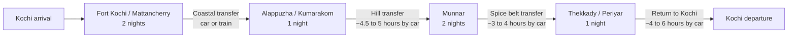

# Kerala Culinary and Cultural Journey

## Executive summary

For a first, research-grounded 7-day trip, the strongest Kerala route is a southern-central loop: entity["city","Kochi","Kochi, Kerala, India"] → entity["place","Fort Kochi","Kochi, Kerala, India"] / entity["place","Mattancherry","Kochi, Kerala, India"] → entity["city","Alappuzha","Alappuzha, Kerala, India"] or entity["place","Kumarakom","Kottayam, Kerala, India"] → entity["city","Munnar","Idukki, Kerala, India"] → entity["place","Thekkady","Idukki, Kerala, India"] / entity["point_of_interest","Periyar Tiger Reserve","Idukki, Kerala, India"] → back to entity["city","Kochi","Kochi, Kerala, India"]. That loop gives the best balance of authentic food, spice-trade history, a backwater stay, tea-country cooking, and evening performance culture without forcing the long northbound or southbound detours needed for entity["place","Wayanad","Wayanad, Kerala, India"], entity["place","Varkala","Thiruvananthapuram, Kerala, India"], or entity["place","Kovalam","Thiruvananthapuram, Kerala, India"]. citeturn35search15turn23search13turn13search6turn15search9turn37search16turn37search1turn37search18turn37search3turn29search0turn29search4turn30search1

Started exactly as requested, using urlthekeralatable.comhttps://thekeralatable.com, urlGooglehttps://www.google.com, urlInstagramhttps://www.instagram.com, urlFacebookhttps://www.facebook.com, urlYouTubehttps://www.youtube.com, urlZomatohttps://www.zomato.com, and urlSwiggyhttps://www.swiggy.com. Those were useful for menu signals, casual restaurant discovery, and cooking-class leads in Kochi, but the uploaded brief and urlthekeralatable.comhttps://thekeralatable.com itself are actually about The Kerala Table restaurant in Navi Mumbai rather than Kerala-state trip planning, so I treated them as secondary discovery sources and then anchored the itinerary in official Kerala tourism, activity providers, and major booking platforms. fileciteturn2file0 citeturn0search0turn0search2turn0search3turn1search0turn1search1

The report below therefore recommends one primary itinerary, then compares stays, cooking classes, transport modes, and cultural shows, and closes with cost bands, seasonal guidance, packing, and three alternative 7-day versions: food-first, nature-plus-food, and luxury. Because travel dates are unspecified, all prices should be treated as current indicative ranges rather than guaranteed quotes, and all performance, ferry, and wildlife timings should be rechecked shortly before travel. citeturn16search4turn16search2turn17search2turn23search13turn19search15

## Recommended route and daily itinerary

This primary itinerary assumes one traveler, six nights, open arrival/departure via Kochi, and a preference for high authenticity over box-ticking. It intentionally prioritizes more time in Kochi/Fort Kochi/Mattancherry and in the hill-plus-spice belt, because that is where the best combination of cooking classes, market immersion, and bookable evening performances is concentrated. citeturn35search15turn29search12turn13search6turn15search9turn16search4turn16search2

### Day one

**Base:** entity["place","Fort Kochi","Kochi, Kerala, India"]  
**Suggested stay:** heritage homestay or boutique hotel  
**Suggested rhythm:** arrive in Kochi by midday, transfer 1–1.5 hours to Fort Kochi, check in, then spend the afternoon on a light heritage-and-food orientation walk through Fort Kochi’s seafront lanes and nearby Mattancherry edges. Keep lunch simple and local: start with entity["food","Appam","Kerala rice pancake"] with stew, or entity["food","Puttu and Kadala Curry","Kerala breakfast combination dish"] if arriving earlier in the day. In the evening, schedule either a full entity["other","Kathakali","classical dance-drama of Kerala"] show or the combined sequence of makeup demonstration plus performance, followed by entity["other","Kalaripayattu","martial art tradition of Kerala"]; the best-documented current slot in Fort Kochi is makeup 5–6 pm, main act 6–7 pm, then Kalaripayattu around 7:15–8:00 pm at the Kerala Kathakali Center. As a dish set for night one, look for entity["food","Fish Moilee","Kerala fish curry in coconut milk"], entity["food","Appam","Kerala rice pancake"], and a Syrian Christian roast or stew. citeturn16search4turn16search7turn24search0turn25search1turn24search4turn31search16

### Day two

**Base:** entity["place","Fort Kochi","Kochi, Kerala, India"] / entity["place","Mattancherry","Kochi, Kerala, India"]  
**Suggested rhythm:** begin around 8:00 am with breakfast, then spend the late morning in Mattancherry and Jew Town, where the spice-trade legacy still shapes the urban fabric. This is the best day for a spice-market walk, antique-and-provisions browsing, and a food-history narrative that ties Arab, Jewish, Dutch, Portuguese, and Syrian Christian influences into one neighborhood. In the afternoon, do your first cooking class in Kochi. The best-fit options are a home-style or small-group class rather than a hotel demo: Freeda’s home meal class, Shamim’s Kerala Muslim class, Jasmin Villa’s seafood-heavy cookery session, or an expert-level demonstration with Nimmy Paul depending on how hands-on you want it to be. If you still have energy after dinner, add a guided Mattancherry food walk rather than a second formal performance. Top flavors to seek today are entity["food","Karimeen Pollichathu","Pearl spot fish wrapped and roasted in banana leaf"], entity["food","Appam","Kerala rice pancake"], entity["food","Sadya","traditional Kerala vegetarian feast"] if available, and community-specific Christian or Muslim dishes depending on your class choice. citeturn15search1turn32search7turn34view4turn34view5turn36view0turn11view1turn35search10turn25search0turn25search2

### Day three

**Base:** entity["city","Alappuzha","Alappuzha, Kerala, India"] or entity["place","Kumarakom","Kottayam, Kerala, India"]  
**Suggested rhythm:** leave Kochi after breakfast. Use train or car to reach Alappuzha for the shortest transition, then either board an overnight houseboat or continue to Kumarakom for a farm or heritage stay. The official Alappuzha tourism package structure still uses roughly 12:00 pm check-in and 9:00 am check-out for overnight houseboats; current market tariffs show a broad gulf between deluxe, premium, and luxury boats, so quality screening matters more than simply “booking a houseboat.” If you want maximum authenticity and cooking depth, Kumarakom often beats a boat: Philipkutty’s Farm combines farm-island atmosphere, backwater food, and cooking-oriented stays. The ideal dishes in this belt are entity["food","Karimeen Pollichathu","Pearl spot fish wrapped and roasted in banana leaf"], entity["food","Kappa and Fish Curry","tapioca with spicy Kerala fish curry"], entity["food","Duck Mappas","Kerala duck curry in coconut-rich gravy"], prawns, and toddy-shop-style curries. citeturn23search13turn23search3turn23search9turn19search11turn19search15turn18search14turn25search0turn25search11turn31search3turn31search11

### Day four

**Base:** entity["city","Munnar","Idukki, Kerala, India"]  
**Suggested rhythm:** breakfast on the water, then depart for Munnar. This is one of the longer but worthwhile transition days, so keep sightseeing light: a tea-estate arrival, a sunset overlook, and an early dinner are enough. If you choose Kumarakom rather than Alappuzha, the transfer is similar in feeling: expect a substantial road climb into the high ranges. Food focus here changes from coastal seafood to estate-country flavors, tea, cardamom, vegetable sides, and strong breakfasts; look especially for entity["food","Puttu and Kadala Curry","Kerala breakfast combination dish"], dosa or appam breakfasts, local tea tastings, and a full Kerala-style thali or sadya if your stay offers one. citeturn37search1turn37search9turn13search6turn13search10turn34view6turn25search1turn25search2

### Day five

**Base:** entity["city","Munnar","Idukki, Kerala, India"]  
**Suggested rhythm:** make this your second major cooking day. The best current fit is the Munnar Village Cooking Class or the similar Kerala traditional village class that begins with a market stop and runs about four hours. That structure is particularly valuable because it adds ingredient literacy, vendor interaction, and context around spices and vegetables before cooking. Use the rest of the day for tea landscapes rather than more driving: tea museum if you want interpretation, or a slow plantation walk if you do not. This is also the easiest day to buy tea, spice gift packs, and simple packaged produce without crowding your coastal days. citeturn11view3turn11view7turn34view7turn34view6turn13search6

### Day six

**Base:** entity["place","Thekkady","Idukki, Kerala, India"] / entity["point_of_interest","Periyar Tiger Reserve","Idukki, Kerala, India"]  
**Suggested rhythm:** depart Munnar after breakfast and reach Thekkady around lunch. Thekkady works best as the spice-and-performance day: spend the afternoon in Kumily’s spice-trade zone or on a guided plantation walk, then watch the evening show circuit. Officially surfaced Thekkady Kathakali performances currently run 5–6 pm and 7–8 pm, and Kalaripayattu is commonly slotted between them around 6–7 pm. If you prefer a culinary rather than wildlife afternoon, replace the plantation walk with Sera’s home-style cooking class or a spice-focused cookery session at Spice Village. The dishes to prioritize here are peppery curries, spice-garden chicken or fish, vegetable sides that use cinnamon/cardamom/clove more assertively than on the coast, and a carefully chosen dessert or payasam. citeturn37search18turn16search2turn16search5turn16search9turn15search1turn15search5turn15search9turn34view1turn14search7

### Day seven

**Base:** early start in entity["place","Thekkady","Idukki, Kerala, India"], then return to entity["city","Kochi","Kochi, Kerala, India"]  
**Suggested rhythm:** if lake levels and capacity permit, take the early Periyar boat rather than an afternoon one. Official current boating slots include 7:30, 9:30, 11:15, 1:45, and 3:30, with reporting required well before departure; however, recent reporting shows that low water can sharply reduce capacity or suspend boating altogether in hot, dry periods, so the morning before departure is the safest check-in pattern. After boating or a short reserve walk, drive back to Kochi for your onward flight or add one extra airport-hotel night if your flight is early the next morning. If you skip boating, use the time for a final spices purchase and a relaxed lunch. citeturn17search0turn17search2turn17search4turn17search8turn17news20turn37search3turn37search7

## Bookable experiences, stays, and transport

### Cooking classes

The strongest class mix for this route is one Kochi class plus one hill-country class. Kochi gives you community-specific cuisine and seafood; Munnar or Thekkady adds market/spice context. Nimmy Paul is best for travelers who enjoy expert demonstration and culinary storytelling; Freeda, Shamim, Jasmin, Munnar Village, and Sera’s are better for hands-on learners. citeturn34view0turn34view4turn34view5turn36view0turn11view3turn34view1

| Cooking class | Best for | Duration | Curriculum focus | Current price signal | Ratings / review signal | Booking |
|---|---|---:|---|---|---|---|
| Nimmy Paul, Kochi | Advanced cooks; Syrian Christian depth | Flexible; class + meal format | Traditional Syrian Christian / Kerala recipes, demonstration-led, home setting | Price not surfaced on official site in this pass; book direct | Longstanding reputation; highly ranked in Cochin culinary experiences | urlOfficial siteturn11view0 / urlExperience pageturn11view1 |
| Freeda, Kochi | Hands-on home cooking | ~3 hrs | Kerala dishes such as chicken stew, fish curry, karimeen pollichathu, breads, dessert | about ₹7,600+ | 5.0/5, 10 reviews, 100% recommended | urlBooking pageturn35search13 |
| Shamim, Kochi | Kerala Muslim cuisine | ~3 hrs | Chattipathiri, Malabar chicken curry, ghee rice, payasam; riverfront home | about ₹6,600+ | 16 operator reviews surfaced | urlBooking pageturn35search1 |
| Jasmin Villa, Kochi | Seafood-heavy small-group class | ~2.5 hrs | 8-dish seafood-forward Kerala meal; prawns, fish curry, vegetable sides, rice | roughly mid-range; source surfaced in foreign currency | 25 reviews surfaced; strong recent feedback | urlBooking pageturn36view0 |
| Munnar Village / Traditional Village class, Munnar | Market visit + cooking | ~4 hrs | ingredient shopping, village interaction, hands-on veg/non-veg Kerala cooking | about US$19 / ~₹1,600–₹2,000 before operator adjustments | 5/5 on one major activity platform; positive traveler reviews | urlOfficial siteturn10search5 / urlBooking pageturn10search9 |
| Sera’s Cooking Class, Kumily near Thekkady | Practical home-style Kerala cooking | flexible; usually afternoon/evening | chicken curry, fish curry, vegetable curry, chapati, rice, side dishes, dessert, spice intro | Price not published in snippet; book direct | 5.0/5 on local review platform; strong recent traveler sentiment | urlOfficial siteturn20search2 |
| Philipkutty’s Farm culinary experience, Kumarakom | Full rural-food immersion | ~4 hrs for culinary tour; longer if staying | farm-to-table lunch/demonstration; backwater-Syrian Christian/Kuttanad flavors | premium; around ₹27,000+ on one current activity listing, but stay guests often build it into package | niche, high-end, highly reviewed | urlFarm stayturn19search11 / urlCulinary tour listingturn35search7 |

**Booking tip:** ask every provider four questions before paying: whether the class is hands-on or demo-led, whether market/farm visits are included, whether seafood/menu can be adjusted for allergies or dietary restrictions, and whether transport is included or easy to arrange from your hotel. Those details vary materially across Kochi and Munnar operators. citeturn34view4turn34view5turn36view0turn11view3turn34view1

### Markets, spice gardens, and cultural performances

For markets, the highest-value urban stop is Mattancherry/Jew Town for spice-trade atmosphere; the highest-value agricultural stop is Kumily/Thekkady for seeing how spices grow and are processed. Kerala Tourism still highlights cinnamon peeling/drying and vanilla hand-pollination as classic elements of Kumily plantation tours, and Kumily remains a spice-shopping hub close to the reserve. Buy small, sealed quantities of black pepper, green cardamom, cloves, cinnamon, nutmeg/mace, vanilla, locally packed tea, and banana chips rather than loose, unlabelled tourist bundles. citeturn15search1turn15search5turn15search9turn15search0turn15search6

For performances, the most reliable Fort Kochi evening is the Kerala Kathakali Center, where official current timing is makeup/artistry 5–6 pm, Kathakali 6–7 pm, and Kalaripayattu 7:15–8:00 pm. In Thekkady, current published slots are generally Kathakali 5–6 pm and 7–8 pm, plus Kalaripayattu around 6–7 pm. For entity["other","Theyyam","ritual performance tradition of North Malabar, Kerala"], do **not** rely on staged tourist listings if ritual authenticity matters; instead use the official Kerala Tourism calendar and the DTPC Kannur calendar. Authentic Theyyam is calendar-based, temple-linked, and concentrated in North Malabar, so it usually belongs in a separate northern itinerary rather than this southern-central loop. citeturn16search4turn16search7turn16search2turn16search5turn16search3turn16search6

| Performance | Best location in this itinerary | Current timing signal | Approximate ticket signal | Booking advice |
|---|---|---|---|---|
| Kathakali | Fort Kochi | 5–6 pm makeup, 6–7 pm show | about ₹600 at Kerala Kathakali Center | Book at least a day ahead in peak season; the makeup hour adds real value | 
| Kalaripayattu | Fort Kochi | around 7:15–8:00 pm | about ₹400 at Kerala Kathakali Center | Ideal on day one as a paired cultural evening |
| Kathakali | Thekkady | 5–6 pm or 7–8 pm | commonly low-to-mid hundreds of rupees depending venue | Good for day six if you skipped Kochi shows |
| Kalaripayattu | Thekkady | commonly around 6–7 pm | around ₹200 at some surfaced venues | Pair with spice-garden afternoon |
| Theyyam | not recommended inside core loop | calendar-driven, often temple-based and seasonal | varies; often not a standard ticketed theater event | Use official calendars and plan a North Kerala add-on |

Sources: citeturn16search4turn16search7turn16search2turn16search5turn16search9turn16search3turn16search6

### Representative accommodations

Use accommodation as part of the food strategy, not just as lodging. In this route, Fort Kochi is where the heritage-building premium matters; backwaters are where meal quality, boat quality, and pace matter; Munnar is where setting matters; Thekkady is where eco-value and spice programming matter. citeturn18search5turn19search11turn20search12turn18search7turn20search10

| Stay type | Representative option | Why it fits this trip | Indicative current price signal | Current review signal | Main drawback | Booking |
|---|---|---|---|---|---|---|
| Fort Kochi premium heritage | Brunton Boatyard | Waterfront colonial-era character, strong dining program, best for a luxury start/end | starts about ₹20,765 on current official offer; other OTAs surfaced lower dynamic pricing | about 4.7/5 on one major OTA | expensive for longer stays | urlOfficial siteturn18search5 |
| Fort Kochi boutique heritage | Old Harbour Hotel | 300-year restored mansion, strong location, easier than ultra-luxury | roughly ₹11,700–₹16,800 average range surfaced | very strong Booking sub-scores for location/comfort; mixed-small-sample OTA review count elsewhere | fewer rooms; pricing fluctuates | urlBooking pageturn19search4 |
| Fort Kochi stylish mid-high | Eighth Bastion | solid compromise between design, service, and price | around US$122 average surfaced on one OTA | about 4.8/5 on one current OTA | less old-world than Brunton/Old Harbour | urlOfficial siteturn22search17 |
| Kumarakom heritage homestay | Philipkutty’s Farm | best culinary authenticity per night; independent villas, farm island, cooking focus | price on request; third-party current villa signals sit in premium band | exceptionally strong long-run sentiment; Kerala Tourism-endorsed homestay | not the cheapest backwater night | urlOfficial siteturn19search11 |
| Kumarakom luxury heritage resort | Coconut Lagoon | high-end backwater stay, heritage structures, strong cuisine, less operational risk than random houseboats | from about ₹16,500+ on one current OTA | about 5/5 on one surfaced OTA | not the same as sleeping on a boat | urlOfficial siteturn20search12 |
| Munnar boutique plantation stay | Windermere Estate | tea-estate atmosphere and strong fit for a slower hill-country day | current OTA signal from about ₹11,000+; official seasonal bundles from ₹25,000 for two nights for two | positive current OTA sentiment, but one composite score was not surfaced clearly in this pass | can feel remote if you want town access | urlOfficial siteturn18search7 |
| Thekkady eco-luxury | Spice Village | strong spice/nature identity, often easiest high-quality base near Periyar | current pricing surfaced from roughly ₹5,780 on one channel and higher on others | about 4.75/5 on one major OTA | premium for what is essentially an eco-property | urlOfficial siteturn20search10 |
| Backwaters on water | Deluxe / premium / luxury houseboat in Alappuzha | best one-night backwater immersion | roughly ₹10,000 / ₹14,000 / ₹25,000 per couple in one current tariff, with premium boats around ₹15,000+ in another tariff source | quality varies by operator more than by category label | largest safety and food-quality variability | urlTariff source oneturn23search9 / urlTariff source twoturn23search3 |

### Transport options

Private car is the default winner on the mountain legs. Train is most useful on coastal segments. A houseboat is an accommodation-experience, not efficient transport. The Kochi Water Metro/local ferry is worth treating as a short urban scenic layer, not as your backbone. citeturn37search16turn37search1turn37search18turn37search3turn37search15turn23search13

| Mode | Best leg(s) | Approximate timing | Approximate current price signal | Pros | Cons | Booking / source |
|---|---|---|---|---|---|---|
| Private car / chauffeur | Kochi–Munnar, Alappuzha–Munnar, Munnar–Thekkady, Thekkady–Kochi | about 4 hrs, 4.5–5 hrs, 3–4 hrs, 4–6 hrs respectively | route examples surfaced from about ₹1,900–₹3,900 on shorter legs; higher on Thekkady–Kochi depending vehicle/platform | door-to-door, flexible, best for food stops and luggage | winding roads, variable pricing, slower in rain | urlKochi–Munnar exampleturn37search4 / urlAlappuzha–Munnar exampleturn37search17 / urlMunnar–Thekkady exampleturn37search18 / urlThekkady–Kochi exampleturn37search7 |
| Intercity bus | Kochi–Munnar | about 3.5–4.5 hrs | about ₹230–₹1,100 surfaced | cheapest hill transfer | less comfortable with luggage; weaker stop control | urlRoute sourceturn37search16 |
| Train | most useful on coastal alternatives and on Kochi–south coast lines; also useful for Kochi–Alappuzha in practice | Kochi–Varkala about 2h48; Kochi–Kovalam about 3h17 to Thiruvananthapuram then short onward hop | Kochi–Kovalam line surfaced around ₹180–₹1,400 | cheap, relaxed coastal movement | not useful for Munnar/Thekkady | urlKochi–Varkala routeturn29search4 / urlKochi–Kovalam routeturn30search1 |
| Kochi Water Metro / ferry | short Kochi urban scenic segments | about 20 min on surfaced High Court–Fort Kochi leg | around ₹40 surfaced | scenic, low cost, reduces road hassle in town | route availability changes; not a whole-trip solution | urlRoute sourceturn37search15 / urlOfficial Water Metro site surfaced earlierturn5search2 |
| Houseboat / day cruise | Alappuzha backwaters | day cruise around 11:30–17:00; overnight roughly 12:00–09:00 official package structure | broad range from budget to ultra-luxury | immersive stay, built-in meals, superb for one night | slow, variable maintenance/food quality, not efficient for onward travel | urlOfficial DTPC package pageturn23search13 |

## Costs, seasonality, food safety, and packing

### Daily and total cost framework

Because the biggest variable is whether you do a day cruise, a private overnight houseboat, or a premium land-based backwater stay, I recommend treating Kerala budgets as **style bundles**, not just hotel-star buckets. The estimates below assume **per person, sharing double occupancy and splitting private-city transfers where relevant**. Solo travelers should usually add roughly ₹15,000–₹40,000 total over the week, especially if taking a private houseboat or private car on all mountain legs. These estimates are built from current surfaced prices for hotels, cooking classes, houseboats, and intercity cab examples. citeturn19search10turn21search0turn20search16turn19search16turn23search3turn23search9turn35search13turn35search1turn34view7turn35search7turn37search4turn37search17turn37search18turn37search7

| Day | Low | Medium | High |
|---|---:|---:|---:|
| Kochi arrival + heritage + show | ₹6,000–₹9,000 | ₹12,000–₹18,000 | ₹25,000–₹40,000 |
| Kochi cooking-class day | ₹8,000–₹12,000 | ₹15,000–₹22,000 | ₹28,000–₹45,000 |
| Backwater day / night | ₹8,000–₹14,000 | ₹18,000–₹30,000 | ₹35,000–₹70,000 |
| Transfer to Munnar + plantation stay | ₹6,000–₹10,000 | ₹12,000–₹19,000 | ₹22,000–₹38,000 |
| Munnar cooking / tea day | ₹7,000–₹11,000 | ₹13,000–₹20,000 | ₹24,000–₹40,000 |
| Thekkady spice + show day | ₹7,000–₹11,000 | ₹13,000–₹21,000 | ₹24,000–₹42,000 |
| Periyar + return to Kochi | ₹4,000–₹8,000 | ₹9,000–₹15,000 | ₹18,000–₹30,000 |
| **Estimated seven-day total** | **₹46,000–₹75,000** | **₹92,000–₹145,000** | **₹176,000–₹305,000+** |

A practical interpretation of those bands is simple: low means clean heritage guesthouses plus one modest class and a simpler backwater night; medium means stylish boutique hotels, curated classes, and premium but not ultra-luxury stays; high means Brunton/Coconut Lagoon/Windermere/Spice Village-level properties, stronger private transport, and premium houseboat or culinary add-ons. citeturn22search8turn22search6turn21search0turn20search16turn19search12turn20search10turn23search8

### Seasonal considerations, food safety, and packing

Kerala’s most comfortable broadly reliable season is still the cooler tourism window from roughly October/November through February, while the southwest monsoon normally reaches Kerala around 1 June and the state also receives a second rainy phase in October/November. Hill stations such as Munnar and Thekkady are cooler than the coast, while backwaters and Kochi remain more humid. For this itinerary, the most important practical seasonal warning is that Thekkady boating can be disrupted not just by rain but also by low water in hotter periods, so that activity should remain flexible. citeturn26search8turn26search3turn26search2turn26search9turn17news20

For food safety, follow the standard high-protection travel rules rather than trying to “eat brave.” Choose busy places with high turnover, eat food that is cooked and served hot, avoid raw seafood and cut fruit unless you trust the handling, and use bottled or verified filtered water for drinking and—if you are sensitive—even for brushing teeth. On houseboats, ask two extra questions: whether seafood is purchased same-day and whether chilled storage is reliable. For activity safety, insist on life jackets and visible railings on boats; recent Kerala reporting shows that poor boat safety standards can still cause real harm. citeturn27search0turn27search11turn27search3turn17search4turn17search15turn23news40

Your practical packing list is short but important: light cotton clothing for the coast; one light warm layer for Munnar/Thekkady evenings; umbrella or light rain shell; insect repellent; sunscreen and hat; modest clothing for temples and other religious sites; easy slip-on sandals; a reusable water bottle; a dry bag or waterproof pouch for boat days; and some cash for local transport and small purchases. The reusable bottle matters more now because Kerala has tightened restrictions on many small single-use plastics in major hill tourism zones including Munnar and Thekkady. citeturn28search3turn28search6turn28search0turn27news35

## Alternative itineraries and route visuals

### Alternative itineraries

If your priority shifts, these are the best 7-day variants.

| Style | Best 7-day structure | Why choose it | What you give up |
|---|---|---|---|
| Food-focused | Kochi/Fort Kochi 3N → Alappuzha/Kumarakom 2N → Thekkady/Kumily 2N | deepest cooking-class density, strongest market-and-spice learning, least rushed | Munnar’s tea-estate landscapes |
| Nature + food | Kochi 1N → Alappuzha/Kumarakom 1N → Munnar 2N → Thekkady 2N → Kochi 1N | best balance of backwaters, hills, reserve, spices, and food | less time in Kochi’s historic neighborhoods |
| Luxury | Fort Kochi 2N → Kumarakom 2N → Munnar 2N → Kochi or Thekkady 1N | best property design, strongest service consistency, smoother pacing | lower spontaneity, much higher cost |

A fourth variant is worth stating even though it falls outside the recommended main loop: if ritual Theyyam is essential, build a **North Kerala** itinerary around Kannur and optionally Wayanad rather than forcing it into a Kochi roundtrip. The official Theyyam calendars are North-Malabar-centered, and Wayanad is a noticeably longer northward commitment from Kochi than the southern-central loop. Likewise, if you want a beach-led southern luxury version, swap Munnar/Thekkady for Varkala or Kovalam; Kochi–Varkala has a direct train option of about 2h48, and Kochi–Kovalam routes via Thiruvananthapuram take a little over 3 hours by train or roughly 4–5 hours by road. citeturn16search3turn16search6turn29search0turn29search13turn29search4turn30search1turn30search3

### Suggested route visual

The route below is the cleanest culinary-and-cultural loop for seven days, with the shortest meaningful sequence of transitions between coast, backwaters, tea highlands, and spice belt. citeturn37search16turn37search1turn37search18turn37search3

And this is the simplest timeline expression for booking order:

- **First reserve:** arrival/departure flights, Fort Kochi stay, one Kochi cooking class, one backwater night, Munnar stay, Thekkady stay. citeturn34view4turn34view5turn36view0turn19search11turn18search7turn20search10  
- **Then reserve:** evening cultural performances in Kochi and/or Thekkady, plus Periyar boating if you want it. citeturn16search4turn16search2turn17search2  
- **Then confirm 2–4 weeks out:** live ferry/Water Metro plans, backwater weather, and any date-specific Theyyam calendar if you are building a north-Kerala extension. citeturn5search2turn17news20turn16search3turn16search6

**Open questions / limitations:** because dates, budget, rooming pattern, and dietary restrictions were left unspecified, all pricing in this report is indicative, not quoted; some accommodation and class providers surfaced strong qualitative signals without exposing a clean single public composite score in the snippet view; and live transport availability—especially Water Metro adjustments, Periyar boating, and houseboat standards—should always be revalidated shortly before travel. citeturn17search2turn17news20turn5search2turn19search15